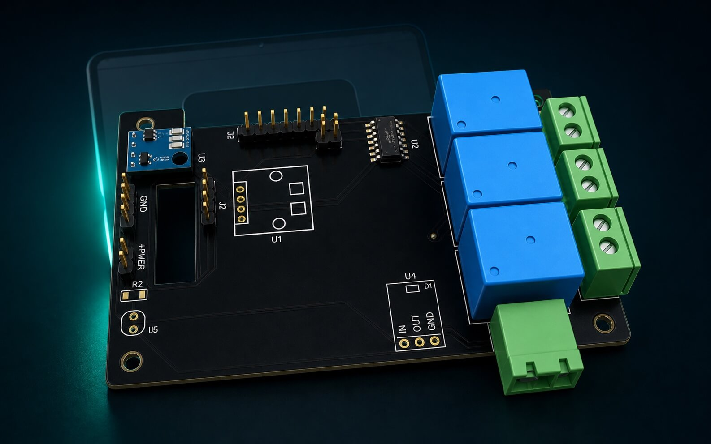

# 🧩 Оборудование и подключение

Язык: [English](HARDWARE.md) | Русский

## 🖥️ Основная плата

Проект основан на ESP32-S3 дисплее `JC3248W535`.

Для нормальной работы используйте стабильный внешний блок питания. Во время тестов было замечено, что питание только от USB-порта компьютера иногда делает интерфейс медленнее. Это зависит от USB-порта и кабеля.

## 🔌 План разъемов

### Большой GPIO-разъем P2

| Pin | GPIO | Использование |
| ---: | ---: | --- |
| P2-1 | IO5 | Резерв. Лучше не использовать для реле, потому что по схеме он связан с измерением батареи. |
| P2-2 | IO6 | Реле вытяжного вентилятора |
| P2-3 | IO7 | Реле приточного вентилятора |
| P2-4 | IO15 | Реле крана воды / насоса |
| P2-5 | IO16 | Резерв |
| P2-6 | IO46 | Не рекомендуется для выходов реле |
| P2-7 | IO9 | Аналоговый вход датчика влажности почвы |
| P2-8 | IO14 | Аналоговый вход LDR-датчика света |

### Маленький 4-pin разъем датчиков

| Сигнал | Использование |
| --- | --- |
| GND | Земля датчиков |
| 3.3V | Питание датчиков |
| IO17 | I2C SDA |
| IO18 | I2C SCL |

Скорость I2C: 100 kHz.

## 🌡️ Датчики климата

### Внутренний датчик

Рекомендуемый модуль:

- 🌿 AHT20 + BMP280
- I2C
- адрес AHT20: `0x38`
- адрес BMP280: обычно `0x76` или `0x77`

Используемые значения:

- температура
- влажность

Давление с BMP280 зарезервировано для будущей логики.

### Наружный датчик

Рекомендуемый модуль:

- 🌤️ SHT40
- I2C
- адрес: `0x44`

Комбинация AHT20 внутри и SHT40 снаружи удобна тем, что у датчиков разные I2C-адреса. Они могут работать на одних и тех же SDA/SCL проводах.

## ⚡ Реле

Можно использовать 3-канальный модуль реле или три отдельных модуля.

| GPIO | Реле | Пример нагрузки |
| ---: | --- | --- |
| IO6 | Exhaust relay | Вентилятор, который выдувает воздух наружу |
| IO7 | Intake relay | Вентилятор, который втягивает воздух внутрь |
| IO15 | Water relay | Кран воды или насос |

По умолчанию реле работают в active-low режиме:

```text
relay_active_low=true
```

Если ваш модуль реле включается уровнем HIGH, укажите:

```text
relay_active_low=false
```

⚠️ Важно: подключение 220V/230V должно выполняться безопасно. Используйте нормальную изоляцию реле, предохранители, фиксацию кабелей и корпус.

## 🌱 Опциональный датчик влажности почвы

Аналоговый вход:

```text
IO9
```

Прошивка может работать без этого датчика. В таком режиме полив управляется по расписанию.

## ☀️ Опциональный датчик света

Аналоговый вход:

```text
IO14
```

Используйте LDR в делителе напряжения от 3.3V.

## 🛠️ Концепт платы реле



Файлы для производства платы лежат в [Gerber.zip](Gerber.zip).

Перед заказом прочитайте [PCB.ru.md](PCB.ru.md): там есть важные замечания по производству и безопасности.
