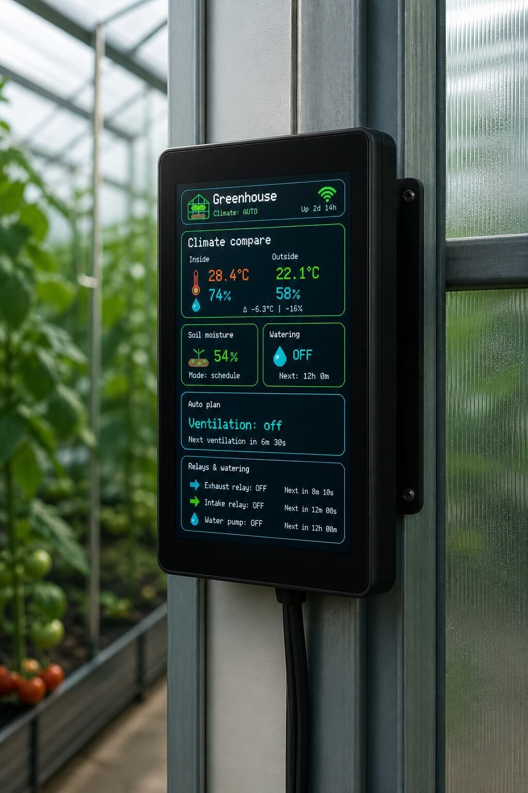

# 🌱 Sols Greenhouse Controller

Language: English | [Русский](README.ru.md)

Smart greenhouse controller based on the JC3248W535 ESP32-S3 touch display.

Turn a small ESP32-S3 touchscreen into a greenhouse dashboard: climate, watering, ventilation, cloud charts and AI-friendly data in one compact device.

This repository contains public documentation, wiring notes, PCB Gerbers and firmware binaries. The Arduino/ESP32 source code is not included.

<p align="center">
  
</p>

## ✨ What It Does

- 📺 Shows greenhouse climate data on a 3.5 inch touch display.
- 📡 Connects to Wi-Fi from `config.txt` on MicroSD.
- ☁️ Sends telemetry to [sols.lv](https://sols.lv).
- 📱 Shows a QR code for cloud dashboard and local setup.
- ⚡ Controls three relays:
  - exhaust fan,
  - intake fan,
  - water valve or pump.
- 🌡️ Compares indoor and outdoor temperature/humidity.
- 💧 Supports watering by schedule or soil moisture sensor.
- 📈 Logs sensor and relay data to MicroSD.

## 🚀 Recommended Installer

The easiest way to install firmware is the web flasher:

👉 [https://sols.lv/upgrade](https://sols.lv/upgrade)

The web installer loads the correct firmware files automatically. Most users should not select `.bin` files manually.

## 🧩 Hardware

Main display:

- 🖥️ JC3248W535 ESP32-S3 touch display
- 320x480 display
- MicroSD card, FAT16 or FAT32
- ESP32-S3 with PSRAM

Sensors:

- 🌡️ Indoor: AHT20 + BMP280 I2C module
- 🌤️ Outdoor: SHT40 I2C module
- 🌱 Optional soil moisture analog sensor
- ☀️ Optional LDR light sensor

Outputs:

- ⚡ 3 relay channels for exhaust, intake and water

See [HARDWARE.md](HARDWARE.md) for wiring.

## 🛠️ Relay And Sensor PCB

This package also includes a Gerber archive:

📦 [Gerber.zip](Gerber.zip)

It can be uploaded to a PCB manufacturer such as JLCPCB, PCBWay or another Gerber-compatible service. The PCB is intended as an add-on relay/sensor board for the greenhouse controller.

See [PCB.md](PCB.md) before ordering.

## 🔥 Firmware Files

Firmware binaries are in [firmware](firmware/).

The preferred format is the multi-file bundle:

| File | Flash address |
| --- | ---: |
| `greenhouse.bootloader.bin` | `0x0` |
| `greenhouse.partitions.bin` | `0x8000` |
| `boot_app0.bin` | `0xe000` |
| `greenhouse.app.bin` | `0x10000` |

There is also `greenhouse.full.bin` for tools that support writing one combined image.

Build target:

- Board: ESP32S3 Dev Module
- Flash size: 16 MB
- Partition scheme: No OTA, 2 MB APP / 2 MB SPIFFS
- PSRAM: OPI PSRAM
- USB CDC on boot: enabled
- CPU: 240 MHz
- Flash mode: QIO 80 MHz in Arduino menu

## 🧾 MicroSD Config

Create `/config.txt` in the root of the MicroSD card.

See [config.example.txt](config.example.txt).

## ☁️ Cloud Dashboard

Device pages are opened with a public token:

```text
https://sols.lv/d/YOUR_PUBLIC_TOKEN
```

The device sends telemetry with a private API token. Do not publish your real `cloud_api_token`.

## 🧪 Project Status

Prototype / early product development.

The wiring and firmware may change while the greenhouse controller is being tested in real installations.

## 🔒 Source Code Policy

This is an open hardware/documentation package with public firmware binaries.

Firmware source code is private for now.

## 📜 License

Documentation and images are provided for project users and installers. Firmware binaries may be used only with this greenhouse controller hardware. Firmware source code is private.
